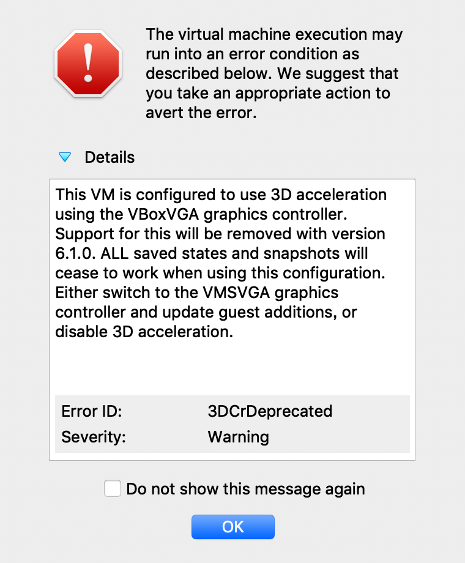

# vagrant-kali-linux

|-|VM名|IPアドレス|ログインパスワード|
|---|---|---|---|
|Kali Linux|kali|`192.168.89.1`|`vagrant:vagrant`<br>`root:toor`|
|Target(CentOS7)|target|`192.168.89.2`|`vagrant:vagrant`|

## DVWAセットアップ(初回のみ)

- OS起動後、 http://192.168.89.2/dvwa/setup.php へアクセス
- ページ中段の `[Create / Reset Database]` をクリック
- ログイン情報に `admin:password` を入力しログイン
- 以降 http://192.168.89.2/dvwa/ でアクセス可能

## 使い方

### VM起動

```
vagrant up
```

上記でKali LinuxとTarget(CentOS7)が起動します。



※Kali Linuxは起動時に上記警告が出ますがそのままOKをクリックしてください。

### VM停止

```
vagrant halt
```

### VM再起動

VM名を指定することで個別に操作可能です。

```
vagrant reload kali
vagrant reload target
```
